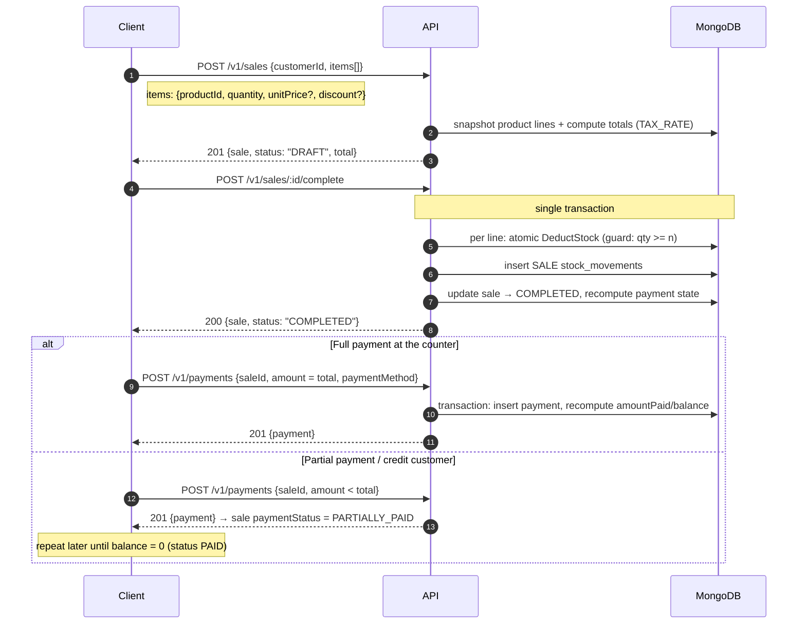
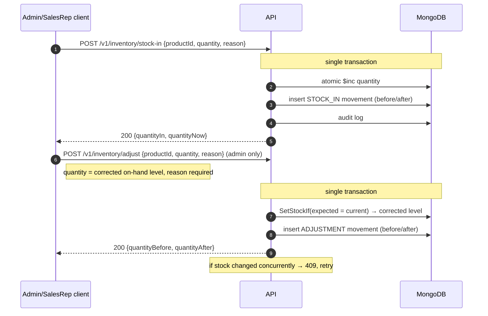
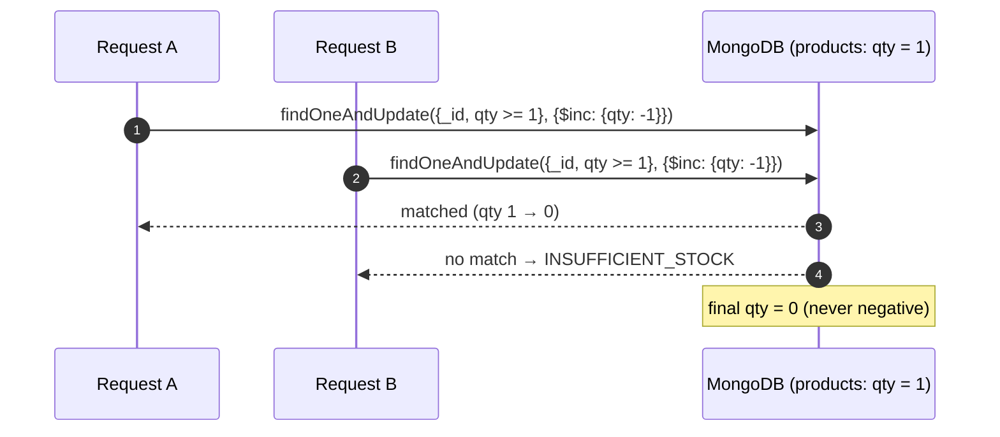

# Car Parts — Sales & Inventory API

Backend for the Car Parts / Tractor Parts / Agricultural Equipment business.

- **Base URL:** `https://<host>/<VERSION>` where `<VERSION>` is set by the `VERSION` env var (e.g. `v1`). All REST endpoints below are prefixed with it, e.g. `https://host/v1/products`.
- **Unversioned endpoints:** `/health`, `/health/ready`, and Socket.io (`/socket.io/*`).
- **Data:** JSON. Money is always a **string** (exact decimal, e.g. `"40.00"` — trailing zeros may be trimmed, e.g. `"40"`). Never use floats client-side.
- **Timestamps:** ISO-8601 / RFC3339 UTC.

---

## 1. Authentication

All protected endpoints require a valid **access token** plus a known **device**. Tokens are opaque strings (not standard JWTs).

### 1.0 First login — seeded administrator

On first start, when the `users` collection is **empty**, the API seeds one administrator with the `ADMIN` role (full `admin` + `super_admin` access):

| Field | Value |
|---|---|
| Email | `admin@business.co.zw` |
| Password | `Admin@12345` |

**Change this password immediately** via `POST /user/change-password`. The seed runs only while no user exists — it will **never** run again once any account is created, so the default password can never be reintroduced later.

### 1.1 Sign in

```
POST /{VERSION}/user/signin
```

Request body:

```json
{
  "email": "rep@business.co.zw",
  "password": "secret"
}
```

Required **headers** (device registration happens here):

| Header | Value |
|---|---|
| `X-Platform` | e.g. `android`, `ios`, `web` |
| `X-Device-Id` | stable per-install UUID |
| `X-Device-OS` | e.g. `android` |
| `X-Device-Name` | device label |
| `X-Device-Model` | device model |
| `X-Device-Platform` | e.g. `android` |

Response `200`:

```json
{ "accessToken": "...", "refreshToken": "..." }
```

- Access token lifetime: **15 minutes**.
- Refresh token lifetime: **7 days**.
- Rate-limited (burst 10, then 1/sec). Errors: `401 invalid credentials`, `403 account suspended`, `400` on bad body.

### 1.2 Refresh tokens

```
GET /{VERSION}/user/refresh
```

Headers: `Authorization: Bearer <refreshToken>` and `X-Device-Id`.

Response `200`:

```json
{ "accessToken": "...", "refreshToken": "...", "message": "Token refreshed successfully" }
```

### 1.3 Sign out

```
GET /{VERSION}/user/signout          (public; needs X-Device-Id)
GET /{VERSION}/user/signout          (also available under auth)
```

Response `200`: `{ "message": "Logout successful" }`

### 1.4 Protected requests — required headers

**Every protected endpoint** (anything not listed under "Public") must send all of:

```
Authorization: Bearer <accessToken>
X-Device-Id
X-Device-OS
X-Device-Name
X-Device-Model
X-Device-Platform
X-Platform
User-Agent
```

Missing any → `403 session expired`. The `X-Device-Id` must correspond to a device registered via sign-in.

### 1.5 Roles & permissions

| Role | Permissions | Can do |
|---|---|---|
| `ADMIN` | `admin`, `super_admin` | everything |
| `SALES_REP` | `sales_rep` | view catalog; create customers/sales/payments/quotations; stock-in; own dashboards |

`super_admin` bypasses all permission checks. Permission failures return `403 insufficient permissions`.

---

## 2. Errors

New modules return a consistent envelope:

```json
{ "error": { "code": "INSUFFICIENT_STOCK", "message": "insufficient stock for SKU-1", "details": { "productId": "...", "sku": "SKU-1", "requested": 2 } } }
```

Business codes:

| Code | HTTP | Meaning |
|---|---|---|
| `VALIDATION` / `INVALID` | 400 | bad input |
| `UNAUTHORIZED` | 401 | bad/expired token |
| `FORBIDDEN` | 403 | missing permission |
| `NOT_FOUND` | 404 | resource missing |
| `INSUFFICIENT_STOCK` | 409 | not enough stock to complete |
| `INVALID_TRANSITION` | 409 | illegal status change |
| `CONFLICT` | 409 | duplicate / state conflict |

Legacy auth endpoints return `{ "message": "..." }` instead. Never rely on the exact `message` text; use `code`/HTTP status.

---

## 3. Users & devices

All protected (see §1.4). Routes under `/user`.

| Method & Path | Permission | Body / Query | Response |
|---|---|---|---|
| `GET /user` | any auth | — | `{ "user": {...}, "message": "..." }` current user |
| `GET /user/users` | admin | `?page` `?limit` `?name` `?role` | `{ "users": [...], "message": "..." }` paginated |
| `GET /user/roles` | any auth | — | `{ "roles": [{ "id": "...", "name": "ADMIN", "permissions": [...] }], "total": n }` |
| `POST /user/signup` | admin | full user `{email, firstName, lastName, phone, roleId, password, ...}` | `{ "message": "Account created successfully" }`; emails the password |
| `POST /user/update` | any auth | partial `{firstName, lastName, phone, email, ...}` | `{ "message": "user updated successfully" }` |
| `POST /user/change-password` | any auth | `{ "oldPassword": "...", "newPassword": "..." }` | `{ "message": "Password changed successfully" }` |
| `POST /user/roles` | admin | `{ "id": "<userId>", "roleId": "<roleId>" }` | `{ "message": "user updated successfully" }` |
| `PATCH /user/admin-update/:id` | super_admin | partial user fields | `{ "message": "User updated successfully" }` |
| `PATCH /user/admin-reset-password/:id` | super_admin | `{ "newPassword": "..." }` (≥6 chars) | `{ "message": "..." }`; emails new password |
| `PATCH /user/status/:id` | super_admin | `{ "status": "active" \| "suspended" }` | `{ "message": "account active" }` |
| `GET /user/devices` | any auth | — | `[{ "deviceId": "...", "name": "...", "model": "...", "platform": "...", "os": "...", "online": true, "lastSeen": "..." }]` |
| `POST /user/signout-device` | any auth | `?deviceId=` (or `X-Device-Id`) | `{ "message": "device signed out successfully" }` |
| `DELETE /user/device/:deviceId` | any auth | — | `{ "message": "device deleted successfully" }` |
| `POST /user/register-device` | any auth | `{ "deviceToken": "<fcm token>" }` | `{ "message": "device notifications registered successfully" }` |

### Password reset flow (public)

1. `POST /user/initiate-reset-password` `{ "email": "..." }` → sends OTP by email. **Rate-limited.** Response: `{ "message": "check your email..." }`
2. `POST /user/validate-otp` `{ "email": "...", "otp": "123456" }` → verifies. **Rate-limited.** Max 5 attempts.
3. `POST /user/reset-password` (also `/user/new-password`) `{ "email": "...", "otp": "...", "password": "new" }` → sets new password.

### Audit logs

| Method & Path | Query | Response |
|---|---|---|
| `GET /audit` | `?page` `?limit` `?actorId` `?action` `?resourceType` `?startDate` `?endDate` (RFC3339 or `YYYY-MM-DD`) | `{ "logs": [...], "total": n, "page": n, "limit": n, "totalPages": n }`; logs populated with the actor's user doc |
| `GET /audit/break-glass` | same | only `isEmergency: true` logs |
| `GET /audit/verify` | — | `{ "valid": true, "total": n, "firstInvalidId": "..." }` chain-integrity check |

---

## 4. Catalog

Reads require auth. Writes require **admin** unless noted.

### 4.1 Categories (hierarchical)

| Method & Path | Body / Query | Response |
|---|---|---|
| `GET /categories` | `?parentId` `?active=true` `?includeDeleted=true` | `{ "categories": [...], "total": n, "message": "..." }` flat |
| `GET /categories/tree` | — | `{ "categories": [{ "id": "...", "name": "...", "children": [...] }] }` nested |
| `GET /categories/:id` | — | `{ "category": {...}, "message": "..." }` |
| `POST /categories` | `{ "name": "...", "description": "...", "parentId": "<oid or null>", "isActive": true }` | `201` `{ "category": {...}, "message": "category created" }` |
| `PATCH /categories/:id` | same shape (partial) | `{ "category": {...}, "message": "category updated" }` |
| `DELETE /categories/:id` | — | soft delete; `409` if it still has children |

Category tree example:

```
Vehicle Parts
├── Car Parts
│   ├── Brake Parts
│   ├── Engine Parts
│   └── Suspension
└── Tractor Parts
    ├── Hydraulic
    ├── Engine
    └── Transmission
```

**Circular parents are rejected server-side** (`409 circular category relationship detected`). Parent must exist and be active.

### 4.2 Brands

| Method & Path | Body / Query | Response |
|---|---|---|
| `GET /brands` | `?search` `?active=true` `?includeDeleted=true` | `{ "brands": [...], "total": n }` |
| `GET /brands/:id` | — | `{ "brand": {...} }` |
| `POST /brands` | `{ "name": "...", "description": "...", "isActive": true }` | `201`; `409` if name exists |
| `PATCH /brands/:id` | partial | `{ "brand": {...} }` |
| `DELETE /brands/:id` | — | soft delete |

### 4.3 Vehicles

| Method & Path | Body / Query | Response |
|---|---|---|
| `GET /vehicles` | `?vehicleType` `?make` `?model` `?includeDeleted=true` | `{ "vehicles": [...], "total": n }` |
| `GET /vehicles/:id` | — | `{ "vehicle": {...} }` |
| `POST /vehicles` | `{ "vehicleType": "CAR", "make": "Toyota", "model": "Hilux", "yearFrom": 2016, "yearTo": 2020, "engine": "2.8 GD-6", "variant": "...", "description": "..." }` | `201` |
| `PATCH /vehicles/:id` | partial | `{ "vehicle": {...} }` |
| `DELETE /vehicles/:id` | — | soft delete |

`vehicleType` must be one of: `CAR`, `TRUCK`, `TRACTOR`, `EQUIPMENT`.

### 4.4 Products

| Method & Path | Body / Query | Response |
|---|---|---|
| `GET /products` | `?search` `?categoryId` `?brandId` `?active=true` `?lowStock=true` `?includeDeleted=true` `?page` `?limit` (max 100) | `{ "products": [...], "total": n, "page": n, "limit": n }` |
| `GET /products/:id` | — | `{ "product": {...} }` |
| `POST /products` | see below | `201` `{ "product": {...} }` |
| `PATCH /products/:id` | same shape (partial; `quantity` ignored) | `{ "product": {...} }` |
| `DELETE /products/:id` | — | soft delete |

Create body:

```json
{
  "sku": "BP-HILUX-001",
  "name": "Toyota Hilux Front Brake Pad",
  "description": "...",
  "categoryId": "<category oid>",
  "brandId": "<brand oid>",
  "partNumber": "04465-0K240",
  "oemNumber": "04465-0K240",
  "costPrice": "25.00",
  "sellingPrice": "40.00",
  "quantity": 15,
  "minimumStockLevel": 5,
  "unit": "PAIR",
  "isActive": true
}
```

- `sku` must be **unique** (`409 sku already exists`).
- `costPrice` / `sellingPrice` required on create, must be ≥ 0.
- `quantity` on create writes an **initial `STOCK_IN` movement** automatically. On update it is ignored — stock is managed via Inventory (§5) only.
- `search` does a case-insensitive **substring** match over name / description / sku / partNumber / oemNumber, so type-ahead works (`ba` → `Bamber`). (For catalogs of many millions a dedicated search engine or n-gram index is recommended; a substring regex scans the collection.)
- `lowStock=true` returns products where `quantity <= minimumStockLevel`.
- Each product also includes populated `category` and `brand` objects (names etc.), not just the raw `categoryId`/`brandId`, on list/get/create/update responses.

### 4.5 Part → vehicle compatibilities

| Method & Path | Body / Query | Response |
|---|---|---|
| `GET /compatibilities` | `?productId` `?vehicleId` | `{ "compatibilities": [...], "total": n }` |
| `POST /compatibilities` | `{ "productId": "<oid>", "vehicleId": "<oid>", "notes": "..." }` | `201`; `409` if the pair already exists; `404` if product/vehicle missing |
| `DELETE /compatibilities/:id` | — | hard delete of the relation |

---

## 5. Customers

Create/update require **admin or sales_rep**; delete requires **admin**.

| Method & Path | Body / Query | Response |
|---|---|---|
| `GET /customers` | `?search` `?customerType` `?active=true` `?includeDeleted=true` `?page` `?limit` | `{ "customers": [...], "total": n, "page": n, "limit": n }` |
| `GET /customers/:id` | — | `{ "customer": {...} }` |
| `POST /customers` | see below | `201` `{ "customer": {...} }` |
| `PATCH /customers/:id` | partial | `{ "customer": {...} }` |
| `DELETE /customers/:id` | — | soft delete (historical sales keep working) |

Create body:

```json
{
  "customerCode": "CUS-000123",
  "name": "Zim Auto Spares (Pvt) Ltd",
  "phone": "+263...",
  "email": "billing@example.co.zw",
  "address": "...",
  "customerType": "BUSINESS",
  "taxNumber": "...",
  "creditAllowed": true,
  "creditLimit": "5000.00",
  "notes": "..."
}
```

- `customerType`: `INDIVIDUAL` or `BUSINESS` (case-insensitive, normalised).
- `customerCode` optional — auto-generated (`CUS-XXXXXX`) when blank; must be unique otherwise.
- `search` matches customerCode / name / phone / email.

---

## 6. Inventory

- `POST /inventory/adjust` is **admin-only** and requires a `reason`.
- `POST /inventory/stock-in` requires admin or sales_rep.
- **Every stock change creates a `stock_movements` ledger entry.** Stock can never go negative.

### 6.1 Stock in

```
POST /inventory/stock-in
```

```json
{ "productId": "<oid>", "quantity": 20, "reason": "New shipment received" }
```

Response `200`:

```json
{ "productId": "<oid>", "quantityIn": 20, "quantityNow": 35, "movementType": "STOCK_IN", "message": "stock received" }
```

### 6.2 Stock adjustment (admin, physical count)

```
POST /inventory/adjust
```

```json
{ "productId": "<oid>", "quantity": 42, "reason": "Physical stock count correction" }
```

`quantity` is the **corrected on-hand level** (not a delta). Before/after are always computed server-side. Response `200`:

```json
{ "productId": "<oid>", "quantityBefore": 40, "quantityAfter": 42, "movementType": "ADJUSTMENT", "message": "stock adjusted" }
```

A concurrent stock change aborts with `409 product stock changed concurrently; retry the adjustment`.

### 6.3 Movement ledger

| Method & Path | Query | Response |
|---|---|---|
| `GET /inventory/movements` | `?productId` `?movementType` `?from` `?to` `?page` `?limit` | `{ "movements": [...], "total": n, "page": n, "limit": n }` |
| `GET /inventory/movements/:productId` | `?page` `?limit` | same, scoped to the product |

Movement types: `STOCK_IN`, `SALE`, `RETURN`, `ADJUSTMENT`. `from`/`to` accept RFC3339 or `YYYY-MM-DD`. Movement shape:

```json
{ "id": "...", "productId": "...", "movementType": "SALE", "quantity": 2, "quantityBefore": 5, "quantityAfter": 3, "referenceType": "SALE", "referenceId": "<sale id>", "reason": "INV-000001", "performedBy": "<userId>", "createdAt": "..." }
```

### 6.4 Low / out of stock

| Method & Path | Response |
|---|---|
| `GET /inventory/low-stock` | `{ "products": [{ "id", "sku", "name", "quantity", "minimumStockLevel", "isActive" }], "total": n }` |
| `GET /inventory/out-of-stock` | same, `quantity == 0` |

---

## 7. Sales

Writes require **admin or sales_rep**. Statuses: `DRAFT → COMPLETED` or `DRAFT → CANCELLED` (no other transitions).

### 7.1 Create sale (DRAFT)

```
POST /sales
```

```json
{
  "customerId": "<customer oid, optional>",
  "discount": "0.00",
  "notes": "Walk-in customer",
  "items": [
    { "productId": "<oid>", "quantity": 2, "unitPrice": "40.00", "discount": "0.00" }
  ]
}
```

- `unitPrice` optional — defaults to the product's current **selling price**.
- All totals (`subtotal`, `discount`, `tax`, `total`) are computed server-side; tax comes from the `TAX_RATE` setting.
- **Stock is NOT deducted here.**

Response `201`:

```json
{
  "sale": {
    "id": "...", "saleNumber": "INV-000001", "quotationId": null,
    "customerId": "...", "salesRepId": "...",
    "items": [{ "productId": "...", "sku": "BP-HILUX-001", "productName": "Toyota Hilux Front Brake Pad", "partNumber": "04465-0K240", "quantity": 2, "unitPrice": "40", "discount": "0", "subtotal": "80" }],
    "subtotal": "80", "discount": "0", "tax": "12", "total": "92", "taxRate": "0.15",
    "amountPaid": "0", "balance": "92", "paymentStatus": "UNPAID",
    "status": "DRAFT", "notes": "Walk-in customer", "createdAt": "...", "updatedAt": "..."
  },
  "message": "sale created"
}
```

### 7.2 Update sale (DRAFT only)

```
PATCH /sales/:id
```

Same body as create. `409` if the sale is already COMPLETED/CANCELLED. Totals recomputed.

### 7.3 Complete sale (deducts stock — atomic)

```
POST /sales/:id/complete
```

- Only `DRAFT` sales complete.
- Runs in a **single transaction**: per-line conditional stock deduction → `SALE` movements → payment state recompute → status `COMPLETED` + `completedAt`.
- If any line has insufficient stock the whole operation rolls back:

```json
{ "error": { "code": "INSUFFICIENT_STOCK", "message": "insufficient stock for BP-HILUX-001", "details": { "productId": "...", "sku": "BP-HILUX-001", "requested": 2 } } }
```

Response `200`: `{ "sale": {...}, "message": "sale completed" }`.

### 7.4 Cancel sale (DRAFT only)

```
POST /sales/:id/cancel
```

Response `200`: `{ "sale": {...}, "message": "sale cancelled" }`. No stock affected.

### 7.5 List & get

| Method & Path | Query | Response |
|---|---|---|
| `GET /sales` | `?saleNumber` `?customerId` `?salesRepId` `?status` `?paymentStatus` `?from` `?to` `?page` `?limit` | `{ "sales": [...], "total": n, "page": n, "limit": n }` |
| `GET /sales/:id` | — | `{ "sale": {...}, "message": "..." }` |

Statuses: `DRAFT`, `COMPLETED`, `CANCELLED`. Payment statuses: `UNPAID`, `PARTIALLY_PAID`, `PAID`.

---

## 8. Payments

Writes require **admin or sales_rep**. Payments are **immutable** once created. Only **COMPLETED** sales accept payments.

### 8.1 Record payment

```
POST /payments
```

```json
{
  "saleId": "<oid>",
  "amount": "92.00",
  "paymentMethod": "ECOCASH",
  "reference": "ECO-123456",
  "notes": "..."
}
```

`paymentMethod`: `CASH`, `ECOCASH`, `BANK_TRANSFER`, `CARD`, `OTHER`.

Rules:
- Overpayments rejected: `400 payment amount exceeds the outstanding balance`.
- Cancelled sales: `409 cannot add a payment to a cancelled sale`.
- Non-completed sales: `409 sale must be completed before receiving payment`.
- `amountPaid`, `balance`, `paymentStatus` are recomputed server-side atomically.

Response `201`: `{ "payment": { "id": "...", "saleId": "...", "amount": "92", "paymentMethod": "ECOCASH", "reference": "ECO-123456", "receivedBy": "<userId>", "notes": "...", "createdAt": "..." }, "message": "payment recorded" }`

### 8.2 List & get

| Method & Path | Query | Response |
|---|---|---|
| `GET /payments` | `?saleId` `?page` `?limit` | `{ "payments": [...], "total": n }` |
| `GET /payments/:id` | — | `{ "payment": {...} }` |

---

## 9. Quotations

Writes require **admin or sales_rep**. Status machine (no jumps):

```
DRAFT → SENT → {ACCEPTED, REJECTED, EXPIRED}
ACCEPTED → CONVERTED
```

### 9.1 Create quotation (DRAFT)

```
POST /quotations
```

```json
{
  "customerId": "<oid>",
  "discount": "0.00",
  "validUntil": "2026-10-01T00:00:00Z",
  "notes": "...",
  "items": [ { "productId": "<oid>", "quantity": 3, "unitPrice": "40.00", "discount": "0.00" } ]
}
```

Response `201` — same shape as a sale but with `quotationNumber` (`QT-000001`), `status: "DRAFT"`, `validUntil`, and no payment fields:

```json
{ "quotation": { "id": "...", "quotationNumber": "QT-000001", "customerId": "...", "salesRepId": "...", "items": [...], "subtotal": "120", "discount": "0", "tax": "18", "total": "138", "taxRate": "0.15", "status": "DRAFT", "validUntil": "...", "notes": "...", "createdAt": "...", "updatedAt": "..." }, "message": "quotation created" }
```

### 9.2 Status transitions

| Method & Path | From → To | Response |
|---|---|---|
| `POST /quotations/:id/send` | DRAFT → SENT | `{ "quotation": {...}, "message": "quotation sent" }` |
| `POST /quotations/:id/accept` | SENT → ACCEPTED | `"quotation accepted"` |
| `POST /quotations/:id/reject` | SENT → REJECTED | `"quotation rejected"` |
| `POST /quotations/:id/expire` | SENT → EXPIRED | `"quotation expired"` |

Any invalid transition returns `409`:

```json
{ "error": { "code": "INVALID_TRANSITION", "message": "cannot move quotation from DRAFT to ACCEPTED" } }
```

### 9.3 Update quotation (DRAFT only)

```
PATCH /quotations/:id
```

Same body as create; `409` if not DRAFT.

### 9.4 Convert to sale

```
POST /quotations/:id/convert
```

Rules (all enforced atomically in one transaction):
- Only `ACCEPTED` quotations.
- Only once (second call → `409 quotation has already been converted`).
- Not past `validUntil` (`409 quotation has expired`).
- Items and **prices are copied verbatim** into a **DRAFT** sale referencing `quotationId`.
- **Stock is NOT deducted** here — complete the resulting sale (§7.3) to deduct stock.

Response `200`:

```json
{ "quotationId": "...", "saleId": "...", "saleNumber": "INV-000007", "message": "quotation converted to sale" }
```

### 9.5 List & get

| Method & Path | Query | Response |
|---|---|---|
| `GET /quotations` | `?quotationNumber` `?customerId` `?salesRepId` `?status` `?page` `?limit` | `{ "quotations": [...], "total": n }` |
| `GET /quotations/:id` | — | `{ "quotation": {...} }` |

---

## 10. Settings (admin only)

| Method & Path | Body | Response |
|---|---|---|
| `GET /settings` | — | `{ "settings": [{ "key": "TAX_RATE", "value": "0.15", "updatedBy": "...", "updatedAt": "..." }], "total": n }` |
| `GET /settings/:key` | — | `{ "setting": {...}, "message": "..." }` |
| `PUT /settings/:key` | `{ "value": "0.15" }` | `{ "setting": {...}, "message": "setting updated" }` |

Known keys: `COMPANY_NAME`, `COMPANY_ADDRESS`, `COMPANY_PHONE`, `COMPANY_EMAIL`, `CURRENCY`, `TAX_RATE`, `INVOICE_PREFIX`, `QUOTATION_PREFIX`. `TAX_RATE` must be a non-negative decimal; updates are audited.

---

## 11. Reports & dashboard

All aggregation-based. Sales reps' data is **automatically scoped** to their own `salesRepId` on `/reports/sales` and `/dashboard/summary`.

### 11.1 Reports

| Method & Path | Permission | Query | Response |
|---|---|---|---|
| `GET /reports/sales` | auth (rep-scoped) | `?from` `?to` `?customerId` `?salesRepId` `?status` | `{ "summary": { "count": n, "revenue": "120.75", "tax": "15.75", "discount": "0" }, "filters": {...}, "message": "sales report" }` |
| `GET /reports/products` | admin | `?from` `?to` | `{ "products": [{ "productId": "...", "sku": "...", "productName": "...", "quantity": n, "revenue": "..." }], "message": "..." }` (top 20 by qty) |
| `GET /reports/sales-reps` | admin | `?from` `?to` | `{ "salesReps": [{ "salesRepId": "...", "repName": "First Last", "count": n, "revenue": "..." }], "message": "..." }` |
| `GET /reports/profit-loss` | admin | `?from` `?to` | `{ "summary": { "sales", "discounts", "tax", "cogs", "grossProfit", "netProfit", "totalCollected", "saleCount" } }` |
| `GET /reports/cashbook` | admin | `?from` `?to` | `{ "openingBalance", "totalIn", "totalOut", "closingBalance", "entries": [...] }` |
| `GET /reports/journal` | admin | `?from` `?to` | `{ "entries": [...], "totalDebit", "totalCredit", "truncated" }` |
| `GET /reports/balance-sheet` | admin | `?to` | `{ "asOf", "cash", "inventory", "accountsReceivable", "totalAssets", "taxPayable", "retainedEarnings", "totalLiabilitiesAndEquity" }` |
| `GET /reports/inventory` | admin | — | `{ "summary": { "products": n, "units": n, "costValue": "...", "sellingValue": "...", "lowStock": n, "outOfStock": n }, "message": "..." }` |

`from`/`to` accept RFC3339 or `YYYY-MM-DD`. Revenue counts **COMPLETED** sales only.

### 11.2 Dashboard summary

```
GET /dashboard/summary
```

Sales reps see only their own sales; low/out-of-stock counts are global.

```json
{
  "summary": {
    "today":   { "count": 3, "revenue": "460.00", "tax": "60.00" },
    "month":   { "count": 40, "revenue": "8200.00", "tax": "1069.57" },
    "all":     { "count": 250, "revenue": "51200.00", "tax": "6678.26" },
    "outstanding": "3400.00",
    "lowStock": 7,
    "outOfStock": 3,
    "topProducts": [{ "productId": "...", "sku": "...", "productName": "...", "quantity": 120, "revenue": "4800.00" }],
    "recentSales": [ { sale... } ],
    "recentMovements": [ { movement... } ]
  },
  "message": "dashboard summary"
}
```

---

## 12. Health (unversioned)

| Method & Path | Response |
|---|---|
| `GET /health` | `200` `{ "status": "ok", "time": "..." }` always |
| `GET /health/ready` | `200` `{ "status": "ready", "time": "...", "checks": { "mongodb": { "status": "ok", "latencyMs": 1 } } }` or `503` when unhealthy |

---

## 13. Socket.io (real-time)

- Endpoint: `/socket.io/*` (unversioned). Rooms use the `/{VERSION}` namespace.
- Connect with headers: `Authorization: Bearer <accessToken>` and `X-Device-Id`.
- Every user joins a room named by their userId; admins additionally join the `admin` room.

Events the client can receive:

| Event | Payload | Notes |
|---|---|---|
| `staff_presence_changed` | `{ "userId", "online", "at" }` | to `admin` room |
| `staff_call_incoming` / `staff_call_ringing` / `staff_call_response` / `staff_call_connected` / `staff_call_ended` / `staff_call_message` | call payloads | staff-call feature |
| `staff_ping` | `{ "fromUserId", "fromName", "text", "at" }` | also delivered as push when offline |
| `audit` | audit log doc | to `admin` room |
| `device_signout` | `{ "deviceId", "userId" }` | emitted when a device is signed out |
| `auth_error` | `{ "code": "TOKEN_EXPIRED" \| "UNAUTHORIZED" \| "ACCOUNT_SUSPENDED", "message": "..." }` | then disconnect |

---

## 14. End-to-end business flows

The sequence diagrams below show the **expected call order** the frontend must follow. Money moves only on **COMPLETED** sales, stock is deducted only at **completion**, and payments are only accepted on completed sales.

### 14.1 Authenticate + register device (first use)

```mermaid
sequenceDiagram
    autonumber
    participant C as Client
    participant A as API
    participant M as MongoDB

    C->>A: POST /v1/user/signin {email, password}
    Note right of C: must also send X-Device-Id, X-Device-OS,<br/>X-Device-Name, X-Device-Model,<br/>X-Device-Platform, X-Platform
    A->>M: find user by email
    A->>A: verify password (bcrypt)
    A->>M: upsert device doc (online, tokens)
    A-->>C: 200 {accessToken, refreshToken}
    Note over C,A: store tokens + deviceId; every later<br/>request sends Authorization: Bearer + device headers
    C->>A: GET /v1/user (validates all headers + device doc)
    A-->>C: 200 {user}
```

### 14.2 Point-of-sale sale (recommended sequence)



> Ordering rules: **complete before paying** — `POST /payments` on a DRAFT sale returns `409`. Overpayments are rejected. `amountPaid`/`balance`/`paymentStatus` are always server-computed, never sent by the client.

### 14.3 Quotation → accepted → converted → sold

```mermaid
sequenceDiagram
    autonumber
    participant C as Client
    participant A as API
    participant M as MongoDB

    C->>A: POST /v1/quotations {customerId, items[], validUntil?}
    A-->>C: 201 {quotation, status: "DRAFT", total}
    C->>A: POST /v1/quotations/:id/send
    A-->>C: 200 {quotation, status: "SENT"}
    C->>A: POST /v1/quotations/:id/accept
    A-->>C: 200 {quotation, status: "ACCEPTED"}
    C->>A: POST /v1/quotations/:id/convert
    Note over A,M: single transaction; prices copied verbatim
    A->>M: create DRAFT sale (quotationId set, INV-xxxxxx)
    A->>M: mark quotation CONVERTED (+ convertedSaleId)
    A-->>C: 200 {saleId, saleNumber}
    Note over C: no stock was deducted yet
    C->>A: POST /v1/sales/:saleId/complete
    Note over A,M: stock deducted here (same as 14.2)
    A-->>C: 200 {sale, status: "COMPLETED"}
    C->>A: POST /v1/payments {saleId, amount, paymentMethod}
    A-->>C: 201 {payment}
```

> Conversion is a **once-only** operation: a second `/convert` returns `409`. Only `ACCEPTED` quotations convert, and never past `validUntil`.

### 14.4 Restock & stock correction



### 14.5 Stock guard (preventing overselling)



---

## 15. Known limitations

- `/user/users`, `/user/staff-presence`, `/user/online-staff` are fully wired (presence hub is active).
- `money` values are returned as strings that may omit trailing zeros (`"40"` not `"40.00"`). Parse with a decimal-capable type (not `float64`).